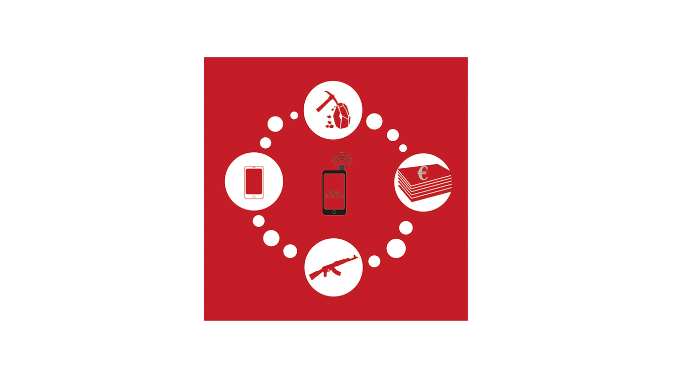
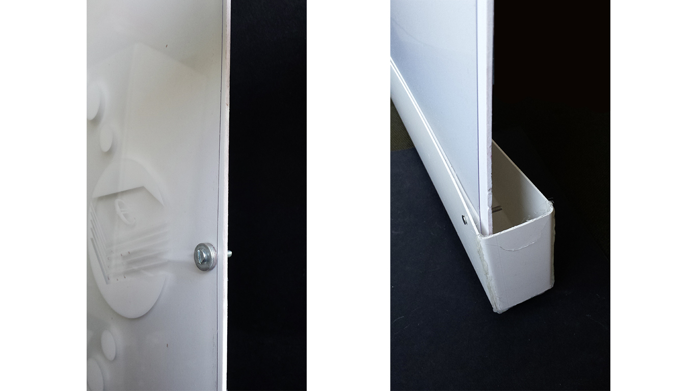
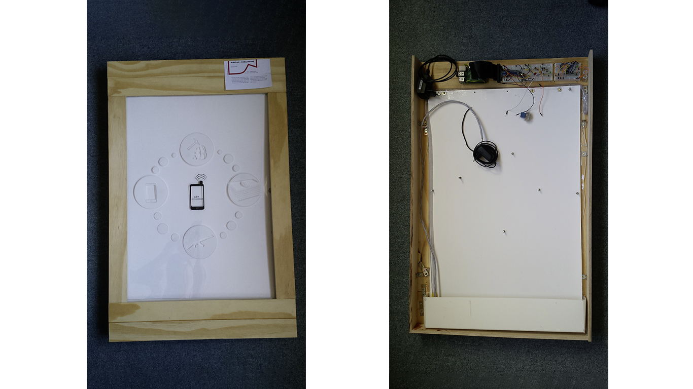

README: Englisch
#The bleeding Poster

 

### Abstract:
The bleeding Poster change is view if someone receive an short message or a call next to the poster. The increasing of electromagnetic waves trigger the poster and it is going to start bleeding and reveals a pictogram.

**1. try to trigger mobile phone radiation:**

- In the beginning I tried to receive radiation from a mobile phone with short dibole antenna (electromagnetic waves) and  hope to induce a small voltage. [explanation move in German](http://www.ebay.de/itm/Flashlight-Handyanhanger-Spanien-Espana-Spain-Handyschmuck-Mobile-Phone-Charm-/261917061109?pt=LH_DefaultDomain_77&hash=item3cfb792ff5)  
(The same type occur earlier in connection with mobile phones. [example](http://www.ebay.de/itm/Flashlight-Handyanhanger-Spanien-Espana-Spain-Handyschmuck-Mobile-Phone-Charm-/261917061109?pt=LH_DefaultDomain_77&hash=item3cfb792ff5)  
- after a long time of research if found a circuit, which provides what I need. [Cell Phone Signal Detector](https://www.seattleu.edu/scieng/ece/laboratory/cellphone/)

**2. Induced voltage should switch Raspberry Pi Pin to:**

- I thought that the induced voltage should easily switch a Raspberry Pi Pin to a High. But it was the biggest problem of the project which I could not solve up to now really. More or less the project failed in reason of that problem.

**3. Finding a good idea of a poster which is trigger by an mobile phone**

- The poster reveal a pictogram by bleeding. To make the idea real I get some good thinking from fellow students. They mean I should stick the pictogram on a transparent plate and put another plate behind the transparent one (in the same color as the pictogram). When some colored weather flow between both plates the pictogram becomes visible. 

- In the space between transparent and colored plate I installed a tube with a pump which will be activate by radiation of a mobile phone. If someone is taking a call next to the poster, the bump will start and change the color of the background, this let the pictogram occur.

**4. The poster becomes a real poster with a frame:**

- the frame was built simply by screw some wood lath.
- on the top and the bottom of the frame is more space to store catch tank, Receiver and booster and also the raspberry pi.

### Prerequisite:

[Raspberry Pi](https://www.tinkersoup.de/raspberry-pi/):

-    Raspberry Pi (I have got a Raspberry Pi 2 Modell B 1GB)
-    Micro SDHC card for the Pi(for the system software)  
-    USB power supply 5V (Handy recharge cable )
-    Pi Cobbler (Adafruit Pi T-Cobbler Plus)
-    [Breadboard](http://www.exp-tech.de/komponenten-zubehoer/breadboards/breadboard-830-630-200) and [Jumper Wires](http://www.exp-tech.de/komponenten-zubehoer/kabel/75-pcs-breadboard-jumper-wires-with-m-m-connectors) 
-    HDMI wire (So that you can connect our Raspberrry Pi to your flat screen and operate it with mouse and keyboard)  
-    Patchable (I recommend a Wi-Fi Dongle, makes it much more easier and you are flexible)  

Receiver und booster:

-    [Cell Phone Signal Detector](https://www.seattleu.edu/scieng/ece/laboratory/cellphone/) (Great page there you find everything you need to know)

Pump und Relay:

-    [Niedervolt-Tauchpumpe Barwig 0444 600 l/h 6 m](http://www.conrad.de/ce/de/product/539090/?gclid=CNnkzrqvkMgCFcFuGwod1a0L6Q&insert_kz=VQ&hk=SEM&WT.srch=1&WT.mc_id=google_pla&s_kwcid=AL!222!3!56269798017!!!g!!&ef_id=U5b7vwAABVnJvAd-:20150924190911:s)  
-    [Relays & Co ](http://www.glacialwanderer.com/hobbyrobotics/?p=9)( The instruction is for a light but you can use it in exactly the same way for the pump. And the same works for the Raspberry Pi) -    you need a fitting flexible tube fort he pi
Poster, frame and catch tank

- Wood lath, wood, screw and angle for the frame
-  fume cupboard tube
-    screw nuts and washer

###Installation:

1. Build the Cellphone detector and connect them with the Pi (In my case the projekt faild here) 
3. If you are able to connect the cellphone detector with the Pi, you can build the pump circuit. 
(++++ code will follow +++++) 
4.    Now you can cut the pictogram by a plotter and stick to the foil to the transparent plate. (attention mirrow-inverted)  
[Pictogramm - black](Pictures/Pictogram-black.ai)  
[Pictogramm - white](Pictures/Pictogram-white.ai)  
 
4. the transparent plate with the pictogram and the second plate(white) should now but together with screw, nuts and washer. Now you should not be able to see the pictogram in reason of the same color of the pictogram and white plate. 
(take a look on the pictures 3. siehe Bild Allgemein 3. Ideenfindung des Plakates und Umsetzung)
5. Only the tube is missing. Therefore use a drilling machine and trill holes in the tube. I used a wood driller.  

6. The catch tank was build out of a fume cupboard tube.  

6. Last step put all together...

### Usage

- Pi circuit diagram for cellphone detector and pump  
(++++ Code will follow +++++)

### Something else:

The connection between cellphone detector and Pi did not work really. As long as there is no stable solution I can ‘not recommend to build the Poster.

### Realted Works:
Inspired from: [Blood in the Mobile](https://facebook.com/bloodinthemobile)

### Thanks:
Thanks to all my friends who took time to implement my algorithm and all my classmates of the Eingabe Ausgabe course summer semester 2015. Especially Fabiantheblind our docent.

### Contact:
In case you have some question or something is not understandable, simply contact me Johannes.Leick@gmx.de have fun.

##Public License
Copyright (C) 2015 Johannes Leick aka JohannesProximo Everyone is permitted to copy and distribute verbatim or modified copies of this license document, and changing it is allowed as long as the name is changed.
